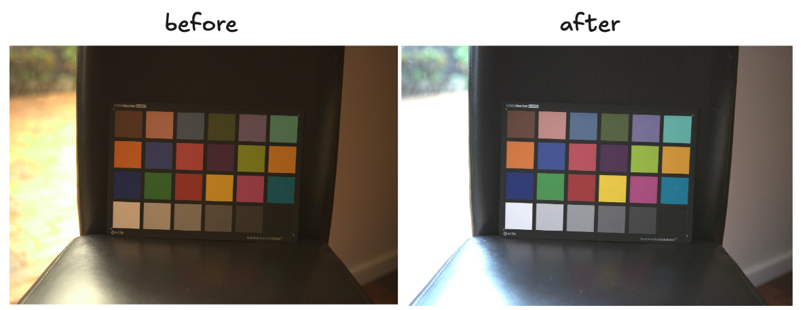

# 🎨 Color Correction 

> **Note:** The "asdfghjkl" is just a placeholder due to some naming difficulties.

This package is designed to perform color correction on images using the Color Checker Classic 24 Patch card. It provides a robust solution for ensuring accurate color representation in your images.

## Installation

```bash
pip install color-correction-asdfghjkl
```
## Usage

```python
image_path = "asset/images/cc-1.jpg"
# image_path = "asset/images/cc-19.png"
filename = os.path.basename(image_path)
input_image = cv2.imread(image_path)

cc = ColorCorrection(detection_model="yolov8", correction_model="least_squares")
input_patches, input_grid_patches, drawed_debug_preprocess = (
    cc.extract_color_patches(
        input_image=input_image,
        debug=True,
    )
)
cc.fit(input_patches=input_patches)
corrected_image = cc.correct_image(input_image=input_image)
corrected_patches = cc.correct_image(input_image=input_grid_patches)
```
Sample output:


## 📈 Benefits
- **Consistency**: Ensure uniform color correction across multiple images.
- **Accuracy**: Leverage the color correction matrix for precise color adjustments.
- **Flexibility**: Adaptable for various image sets with different color profiles.


<!-- write reference -->
## 📚 References
- [Color Checker Classic 24 Patch Card](https://www.xrite.com/categories/calibration-profiling/colorchecker-classic)
- [Color Correction Tool ML](https://github.com/collinswakholi/ML_ColorCorrection_tool/tree/Pip_package)
- [Colour Science Python](https://www.colour-science.org/colour-checker-detection/)
- [Fast and Robust Multiple ColorChecker Detection ()](https://github.com/pedrodiamel/colorchecker-detection)
- [Automatic color correction with OpenCV and Python (PyImageSearch)](https://pyimagesearch.com/2021/02/15/automatic-color-correction-with-opencv-and-python/)
- [ONNX-YOLOv8-Object-Detection](https://github.com/ibaiGorordo/ONNX-YOLOv8-Object-Detection)
- [yolov8-triton](https://github.com/omarabid59/yolov8-triton/tree/main)
- [Streamlined Data Science Development: Organizing, Developing and Documenting Your Code](https://medium.com/henkel-data-and-analytics/streamlined-data-science-development-organizing-developing-and-documenting-your-code-bfd69e3ef4fb)