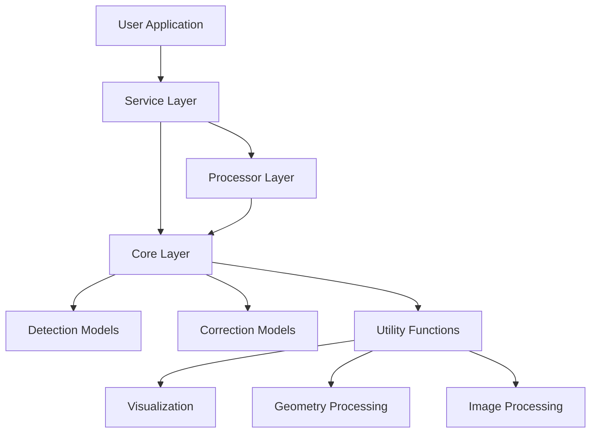
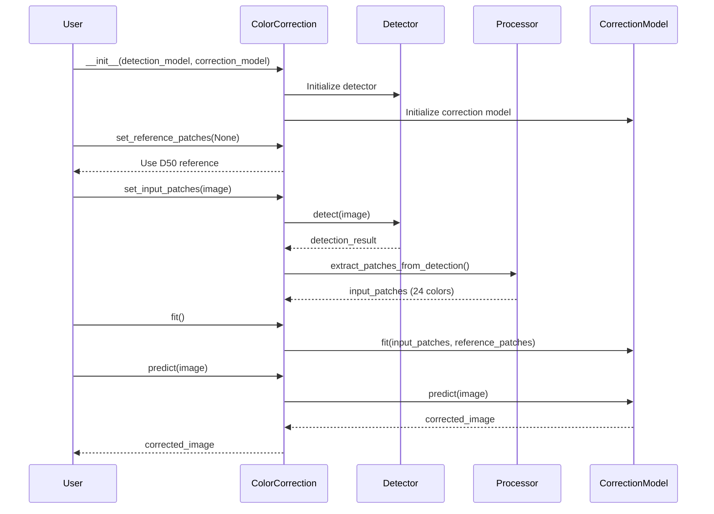
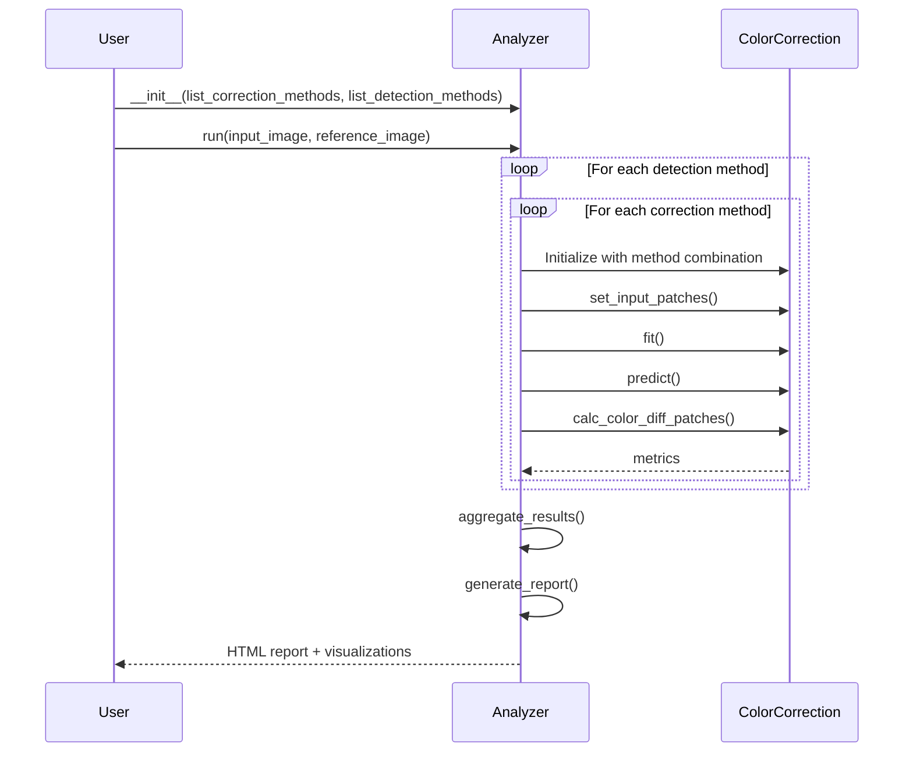

# Architecture

This document provides an overview of the `color-correction` package architecture, component interactions, and extension points.

## System Overview

The `color-correction` package is designed with a layered architecture that promotes separation of concerns, maintainability, and extensibility.



## Architecture Layers

### 1. Service Layer

**Location:** `color_correction/services/`

The service layer provides high-level APIs for end-users. It orchestrates the workflow between detection and correction operations.

#### ColorCorrection Service

**File:** `color_correction/services/color_correction.py`

Main responsibilities:
- Initialize detection and correction models
- Manage reference and input color patches
- Coordinate the color correction workflow
- Generate debug visualizations
- Calculate color difference metrics

**Key Methods:**
- `set_reference_patches(image, debug)`: Extract reference patches from image or use default D50
- `set_input_patches(image, debug)`: Extract input patches from test image
- `fit()`: Train the correction model
- `predict(input_image, debug, debug_output_dir)`: Apply correction to image
- `calc_color_diff_patches()`: Evaluate correction quality

#### ColorCorrectionAnalyzer Service

**File:** `color_correction/services/correction_analyzer.py`

Main responsibilities:
- Compare multiple correction methods
- Compare multiple detection methods
- Generate comprehensive analysis reports
- Produce benchmarking visualizations

**Key Methods:**
- `run(input_image, reference_image, output_dir)`: Execute full analysis
- `_generate_report()`: Create HTML report with results
- `_benchmark_methods()`: Compare correction methods

### 2. Processor Layer

**Location:** `color_correction/processor/`

The processor layer handles preprocessing and intermediate data transformations.

#### Detection Processor

**File:** `color_correction/processor/detection.py`

Responsibilities:
- Preprocess detection results
- Extract color patches from detected regions
- Handle segmentation-based detection
- Manage patch ordering and validation

**Key Functions:**
- `extract_patches_from_detection(image, detection_result)`: Convert detections to patches
- `extract_patches_from_segmentation(image, vertices)`: Extract patches from polygon
- `extract_color_patches(image, ls_box_tuple)`: Get average color per patch

### 3. Core Layer

**Location:** `color_correction/core/`

The core layer implements the fundamental algorithms for detection and correction.

#### Detection Models

**File:** `color_correction/core/card_detection/`

##### YOLOv8 ONNX Detector

**File:** `det_yv8_onnx.py`

- ONNX Runtime-based YOLOv8 implementation
- Supports GPU acceleration
- Fast and accurate card detection
- Configurable confidence and IoU thresholds

**Key Components:**
- `YOLOv8Det`: Main detector class
- `preprocess_input()`: Image preprocessing for ONNX
- `postprocess_output()`: NMS and confidence filtering

##### MCC Detector

**File:** `mcc_det.py`

- OpenCV's mcc module implementation
- Robust detection algorithm
- No deep learning required
- Good for controlled environments

**Key Components:**
- `MCCardDetector`: Main detector class
- Integrates with cv2.mcc module

#### Correction Models

**File:** `color_correction/core/correction/`

All correction models implement a common interface:

```python
class CorrectionModel:
    def fit(self, X: np.ndarray, y: np.ndarray) -> None:
        """Train the model on input and reference patches."""
        pass

    def predict(self, X: np.ndarray) -> np.ndarray:
        """Apply correction to input data."""
        pass
```

##### Least Squares Correction

**File:** `least_squares.py`

- Simple and fast
- Linear transformation
- Good for minor corrections
- No hyperparameters

##### Polynomial Correction

**File:** `polynomial.py`

- Polynomial regression
- Configurable degree (default: 3)
- Better for non-linear color shifts
- May overfit with high degrees

##### Affine Registration

**File:** `affine_reg.py`

- Affine transformation
- Preserves parallel lines
- Good geometric properties
- Moderate computational cost

##### Linear Regression

**File:** `linear_reg.py`

- sklearn-based linear regression
- Ridge regularization available
- Fast and stable
- Good baseline method

### 4. Utility Layer

**Location:** `color_correction/utils/`

Provides common utilities used across the package.

#### Geometry Processing

**File:** `geometry_processing.py`

**Functions:**
- `generate_expected_patches(card_box)`: Create 4×6 patch grid
- `suggest_missing_patch_coordinates(ls_ordered_patch)`: Infer missing patches
- `extract_intersecting_patches(expected_patches, detected_boxes)`: Match detections to grid
- `order_patches_to_4x6_grid(ls_box_tuple)`: Sort patches in reading order

#### Image Processing

**File:** `image_processing.py`

**Functions:**
- `resize_image(image, target_size)`: Resize with aspect ratio preservation
- `normalize_image(image)`: Normalize pixel values
- `crop_region(image, box)`: Extract image region

#### Visualization

**File:** `visualization_utils.py`

**Functions:**
- `visualize_patch_comparison(ls_mean_in, ls_mean_ref)`: Compare patch colors
- `create_image_grid_visualization(images, grid_size, figsize)`: Create debug grid
- `draw_detection_boxes(image, boxes, labels)`: Annotate detections

#### Report Generation

**File:** `report_generator.py`

**Functions:**
- `generate_html_report(results, output_path)`: Create HTML analysis report
- `plot_color_difference_chart(metrics)`: Visualize color differences
- `create_comparison_table(methods, metrics)`: Tabular comparison

## Data Flow

### Color Correction Workflow



### Analyzer Workflow



## Extension Points

### Adding a New Detection Model

1. Create a new class in `color_correction/core/card_detection/`
2. Implement the detection interface:

```python
from color_correction.schemas.yv8_onnx import DetectionResult

class MyDetector:
    def __init__(self, **kwargs):
        # Initialize your model
        pass

    def detect(self, image: np.ndarray) -> DetectionResult:
        # Implement detection
        boxes = []  # List of [x1, y1, x2, y2]
        scores = []  # Confidence scores
        class_ids = []  # Class IDs (0 for color checker)

        return DetectionResult(
            boxes=boxes,
            scores=scores,
            class_ids=class_ids,
        )
```

3. Register in `color_correction/constant/methods.py`:

```python
LiteralModelDetection = Literal["yolov8", "mcc", "my_detector"]
```

4. Add factory method in detection processor

### Adding a New Correction Model

1. Create a new class in `color_correction/core/correction/`
2. Implement the correction interface:

```python
import numpy as np

class MyCorrectionModel:
    def __init__(self, **kwargs):
        # Initialize hyperparameters
        self.model = None

    def fit(self, X: np.ndarray, y: np.ndarray) -> None:
        """
        Train the correction model.

        Parameters
        ----------
        X : np.ndarray
            Input patches, shape (24, 3) - BGR colors
        y : np.ndarray
            Reference patches, shape (24, 3) - BGR colors
        """
        # Train your model
        pass

    def predict(self, X: np.ndarray) -> np.ndarray:
        """
        Apply correction.

        Parameters
        ----------
        X : np.ndarray
            Input image or patches

        Returns
        -------
        np.ndarray
            Corrected image or patches
        """
        # Apply correction
        return corrected
```

3. Register in `color_correction/constant/methods.py`:

```python
LiteralModelCorrection = Literal[
    "least_squares",
    "polynomial",
    "linear_reg",
    "affine_reg",
    "my_correction",
]
```

4. Add factory method in ColorCorrection service

### Adding New Visualizations

1. Add visualization function to `color_correction/utils/visualization_utils.py`
2. Follow the pattern:

```python
def my_visualization(
    data: Any,
    output_path: str | None = None,
    **kwargs
) -> np.ndarray | None:
    """
    Create custom visualization.

    Parameters
    ----------
    data : Any
        Input data for visualization
    output_path : str | None
        If provided, save to disk
    **kwargs
        Additional parameters

    Returns
    -------
    np.ndarray | None
        Visualization image if output_path is None
    """
    # Create visualization using matplotlib or cv2
    pass
```

## Design Patterns

### Factory Pattern

Used for creating detection and correction models:

```python
# In ColorCorrection service
def _initialize_detector(self, model_name: str, **kwargs):
    if model_name == "yolov8":
        return YOLOv8Det(**kwargs)
    elif model_name == "mcc":
        return MCCardDetector(**kwargs)
    else:
        raise ValueError(f"Unknown model: {model_name}")
```

### Strategy Pattern

Correction models are interchangeable strategies:

```python
# User can switch between correction strategies
cc = ColorCorrection(correction_model="polynomial", degree=3)
# or
cc = ColorCorrection(correction_model="least_squares")
# or
cc = ColorCorrection(correction_model="affine_reg")
```

### Template Method Pattern

ColorCorrection service defines the workflow template:

```python
def correction_workflow(self):
    self.set_reference_patches()  # Step 1
    self.set_input_patches(image)  # Step 2
    self.fit()  # Step 3
    result = self.predict(image)  # Step 4
    return result
```

## Configuration Management

### Constants

**Location:** `color_correction/constant/`

- `color_checker.py`: Reference color values (D50, D65)
- `methods.py`: Available model types
- `yolov8_det.py`: YOLOv8 configuration

### Settings

Default settings are hardcoded but can be overridden via constructor parameters:

```python
ColorCorrection(
    detection_model="yolov8",  # or "mcc"
    detection_conf_th=0.25,  # Detection confidence threshold
    correction_model="polynomial",  # or "least_squares", "affine_reg", "linear_reg"
    degree=3,  # For polynomial only
    use_gpu=False,  # GPU acceleration
)
```

## Error Handling

### Exception Hierarchy

**File:** `color_correction/exceptions.py`

```
ColorCorrectionError (Base)
├── DetectionError
│   ├── NoCardDetectedError
│   └── InsufficientPatchesError
├── CorrectionError
│   ├── ModelNotFittedError
│   └── InvalidParametersError
├── InvalidImageError
├── ModelLoadError
└── UnsupportedModelError
```

### Error Handling Strategy

1. **Input Validation**: Validate at API boundaries
2. **Specific Exceptions**: Use custom exceptions for different error types
3. **Helpful Messages**: Provide actionable error messages
4. **Fail Fast**: Detect errors early in the workflow

## Performance Considerations

### GPU Acceleration

YOLOv8 ONNX detector supports GPU through ONNX Runtime:

```python
cc = ColorCorrection(
    detection_model="yolov8",
    use_gpu=True,  # Enable GPU
)
```

### Memory Management

- Images are processed in-place where possible
- ONNX models are loaded once and reused
- Large visualizations are optionally saved to disk

### Optimization Opportunities

1. **Batch Processing**: Process multiple images in one call
2. **Model Caching**: Cache loaded ONNX models
3. **Parallel Analysis**: Run different methods in parallel
4. **Vectorization**: Use NumPy operations for patch processing

## Testing Strategy

### Test Structure

```
tests/
├── core/
│   ├── card_detection/
│   │   ├── test_mcc_detector.py
│   │   └── test_yv8_onnx.py
│   └── correction/
│       ├── test_least_squares.py
│       ├── test_polynomial.py
│       ├── test_affine_reg.py
│       └── test_linear_reg.py
├── services/
│   ├── test_color_correction.py
│   └── test_correction_analyzer.py
├── utils/
│   ├── test_geometry_processing.py
│   └── test_visualization.py
└── integration/
    └── test_end_to_end.py
```

### Test Types

1. **Unit Tests**: Test individual functions and methods
2. **Integration Tests**: Test component interactions
3. **End-to-End Tests**: Test complete workflows
4. **Property Tests**: Test invariants with hypothesis

## Dependencies

### Core Dependencies

- **opencv-contrib-python**: Image processing and MCC detector
- **onnxruntime**: ONNX model inference
- **onnx**: ONNX model format
- **numpy**: Numerical operations
- **scikit-learn**: Machine learning algorithms
- **colour-science**: Color space conversions
- **shapely**: Geometric operations
- **matplotlib**: Visualization
- **pandas**: Data analysis

### Development Dependencies

- **pytest**: Testing framework
- **pytest-cov**: Coverage reporting
- **ruff**: Linting and formatting
- **pre-commit**: Git hooks
- **mkdocs**: Documentation generation

## Future Improvements

### Planned Features

1. **Logging System**: Replace print statements with structured logging
2. **Auto-orientation**: Automatically detect and correct card orientation
3. **Batch Processing API**: Process multiple images efficiently
4. **More Evaluation Metrics**: Add Delta E 2000, SSIM, etc.
5. **YOLOv11 Segmentation**: Add segmentation-based detection
6. **Configuration Files**: Support YAML/JSON configuration
7. **CLI Tool**: Command-line interface for quick corrections
8. **Web Service**: REST API for color correction

### Architecture Evolution

- **Plugin System**: Dynamic model loading
- **Caching Layer**: Cache intermediate results
- **Async Support**: Asynchronous image processing
- **Streaming**: Process video streams
- **Distributed Processing**: Multi-GPU support

## References

- [Clean Architecture](https://blog.cleancoder.com/uncle-bob/2012/08/13/the-clean-architecture.html)
- [SOLID Principles](https://en.wikipedia.org/wiki/SOLID)
- [Design Patterns](https://refactoring.guru/design-patterns)
- [Python Package Structure](https://docs.python-guide.org/writing/structure/)
