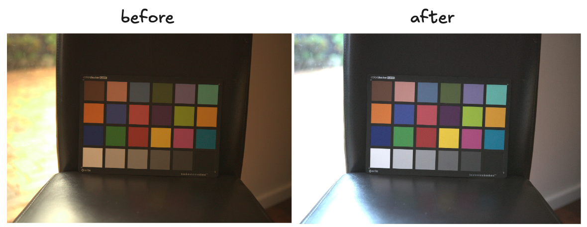

# Color Correction

## Introduction


This is the main feature of this package. Its capture to color correct an image using a color checker card. The color correction process involves the following steps:

1. **Extract Color Patches**: Extract color patches from the input image using a color checker card.
2. **Fit the Model**: Fit the color correction model to the extracted color patches.
3. **Predict**: Apply the color correction model to the input image to correct the colors.

## Limitations

- The color correction model is only applicable to images with a color checker card.
- The color correction model is not suitable for images with different camera settings (e.g., white balance, exposure, etc.) and environmental conditions (e.g., lighting conditions).


## Usage

???+ warning "Image Requirements"

    For color correction to work properly, the input image **must** have a color checker card in the image. However, after fitting the model, you can use the model to correct other images without a color checker card.


???+ tip "If you don't have image to test"

    You can download the sample image from the following link:
    ```bash
    curl -L -o input_image.jpg "https://drive.google.com/uc?export=download&id=1syOqw9kC0tt01p7yEobU4MeLfh336DZA"
    ```


=== "Code"

    ```python
    from color_correction import ColorCorrection
    import cv2
    import matplotlib.pyplot as plt

    # Step 1: Define the path to the input image
    image_path = "your_path_image"

    # Step 2: Load the input image
    input_image = cv2.imread(image_path)

    # Step 3: Initialize the color correction model with specified parameters
    color_corrector = ColorCorrection(
        detection_model="yolov8",
        detection_conf_th=0.25,
        correction_model="affine_reg", # (1)
        degree=3,  # (2)
        use_gpu=False, # (3)
    )

    # Step 4: Extract color patches from the input image
    # color_corrector.set_reference_patches(image=None, debug=True) # (7)
    color_corrector.set_input_patches(image=input_image, debug=True) # (4)
    color_corrector.fit() # (5)
    corrected_image = color_corrector.predict(
        input_image=input_image,
        debug=True, # (6)
        debug_output_dir="output-color-correction-debug",
    )

    # Step 5 (Optional): Evaluate the color correction results
    eval_result = color_corrector.calc_color_diff_patches()
    print(eval_result)

    # Step 6 (Optional): write the corrected image to the disk
    cv2.imwrite("corrected_image.jpg", corrected_image)
    ```

    1. `correction_model`: The color correction model to use. The available options are `least_squares`, `affine_reg`, `linear_reg`, and `polynomial`.
    2. `degree`: The degree of the polynomial model. This parameter is only used when `correction_model` is set to `polynomial`.
    3. `use_gpu`: this for detect color patches. we running ONNX yolov8 detection model
    4. `debug`: if True, the color patches will be displayed on the input image.
    5. `fit`: fit the model to the extracted color patches. will set the reference patches and calculate the correction matrix.
    6. `debug`: if True, will write the debug image to the specified directory.
    7. `set_reference_patches`: Allows setting reference color patches from either an external image containing a color checker card or utilizing the default D50 illuminant values. This provides flexibility in establishing color correction standards.


=== "output: corrected_image"

    

=== "output: preprocess_debug_image"

    

## API Reference

- [`class` ColorCorrection](../reference/services/color_correction.md)
